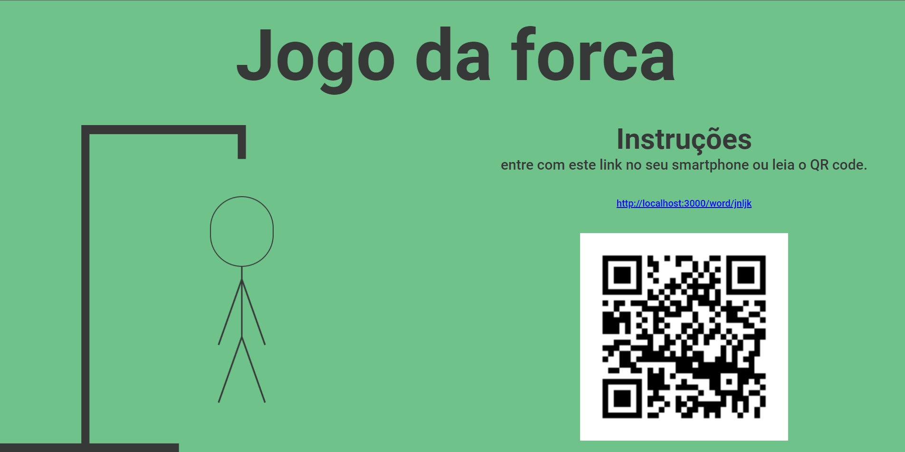
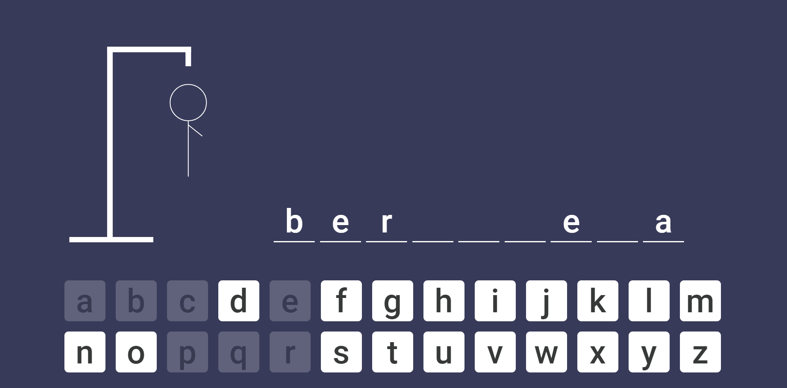

<h1 align="center" style="font-weight: bold;">
  Jogo da forca!
</h1>

  <a href="#-projeto">Projeto</a>&nbsp;&nbsp;&nbsp;|&nbsp;&nbsp;&nbsp;
  <a href="#-tecnologias">Tecnologias</a>&nbsp;&nbsp;&nbsp;|&nbsp;&nbsp;&nbsp;
  <a href="#-como-executar">Como executar</a>

---

## 💻 Projeto

Este projeto tem por objetivo ser um jogo da forca simples, mas que envolve-se as funções serverless do NextJs e trabalhar com SVG e Sass.

## ✨ Tecnologias

Esse projeto foi desenvolvido com as seguintes tecnologias:

- [React](https://reactjs.org)
- [Next.js](https://nextjs.org/)
- [TypeScript](https://www.typescriptlang.org/)
- [Sass](https://sass-lang.com/)

## 🚀 Como executar

- Clone o repositório
- Instale as dependências com `yarn` ou `npm i`
- Inicie o servidor com `yarn dev` ou `npm run dev`
